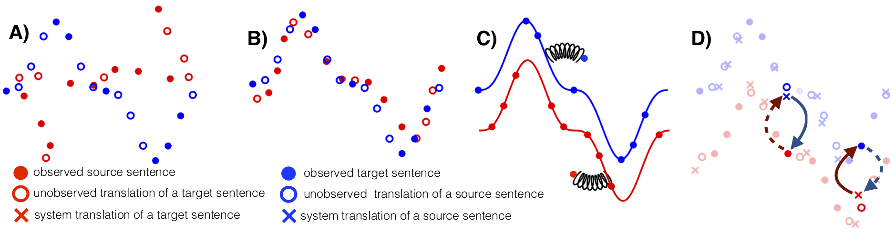

# Unsupervised Machine Translation

This repository contains the original implementation of the unsupervised PBSMT and NMT models presented in  
[Phrase-Based & Neural Unsupervised Machine Translation](https://arxiv.org/abs/1804.07755) (EMNLP 2018).

### Note: for the NMT approach, we recommend you have a look at [Cross-lingual Language Model Pretraining](https://arxiv.org/abs/1901.07291) and the associated GitHub repository https://github.com/facebookresearch/XLM which contains a better model and a more efficient implementation of unsupervised machine translation.



The NMT implementation supports:
- Three machine translation architectures (seq2seq, biLSTM + attention, Transformer)
- Ability to share an arbitrary number of parameters across models / languages
- Denoising auto-encoder training
- Parallel data training
- Back-parallel data training
- On-the-fly multithreaded generation of back-parallel data

As well as other features not used in the original paper (and left for future work):
- Arbitrary number of languages during training
- Language model pre-training / co-training with shared parameters
- Adversarial training

The PBSMT implementation supports:
- Unsupervised phrase-table generation scripts
- Automated Moses training

## Dependencies

* Python 3
* [NumPy](http://www.numpy.org/)
* [PyTorch](http://pytorch.org/) (currently tested on version 0.5)
* [Moses](http://www.statmt.org/moses/) (clean and tokenize text / train PBSMT model)
* [fastBPE](https://github.com/glample/fastBPE) (generate and apply BPE codes)
* [fastText](https://github.com/facebookresearch/fastText) (generate embeddings)
* [MUSE](https://github.com/facebookresearch/MUSE) (generate cross-lingual embeddings)

For the NMT implementation, the `NMT/get_data_enfr.sh` script will take care of installing everything (except PyTorch). The same script is also provided for English-German: `NMT/get_data_deen.sh`. The NMT implementation only requires Moses preprocessing scripts, which does not require to install Moses.

The PBSMT implementation will require a working implementation of Moses, which you will have to install by yourself. Compiling Moses is not always straightforward, a good alternative is to download [the binary executables](http://www.statmt.org/moses/?n=moses.releases).

## Unsupervised NMT

### Download / preprocess data

The first thing to do to run the NMT model is to download and preprocess data. To do so, just run:

```
git clone https://github.com/facebookresearch/UnsupervisedMT.git
cd UnsupervisedMT/NMT
./get_data_enfr.sh
```

The script will successively:

- Install tools
    + Download Moses scripts
    + Download and compile fastBPE
    + Download and compile fastText
- Download and prepare monolingual data
    + Download / extract / tokenize monolingual data
    + Generate and apply BPE codes on monolingual data
    + Extract training vocabulary
    + Binarize monolingual data
- Download and prepare parallel data (for evaluation)
    + Download / extract / tokenize parallel data
    + Apply BPE codes on parallel data with training vocabulary
    + Binarize parallel data
- Train cross-lingual embeddings

`get_data_enfr.sh` contains a few parameters defined at the beginning of the file:
- `N_MONO` number of monolingual sentences for each language (default 10000000)
- `CODES` number of BPE codes (default 60000)
- `N_THREADS` number of threads in data preprocessing (default 48)
- `N_EPOCHS` number of fastText epochs (default 10)

Adding more monolingual data will improve the performance, but will take longer to preprocess and train (10 million sentences is what was used in the paper for NMT). The script should output a data summary that contains the location of all files required to start experiments:

```
Monolingual training data:
    EN: ./data/mono/all.en.tok.60000.pth
    FR: ./data/mono/all.fr.tok.60000.pth
Parallel validation data:
    EN: ./data/para/dev/newstest2013-ref.en.60000.pth
    FR: ./data/para/dev/newstest2013-ref.fr.60000.pth
Parallel test data:
    EN: ./data/para/dev/newstest2014-fren-src.en.60000.pth
    FR: ./data/para/dev/newstest2014-fren-src.fr.60000.pth

Concatenated data in: ./data/mono/all.en-fr.60000
Cross-lingual embeddings in: ./data/mono/all.en-fr.60000.vec
```

Note that there are several ways to train cross-lingual embeddings:
- Train monolingual embeddings separately for each language, and align them with [MUSE](https://github.com/facebookresearch/MUSE) (please refer to [the original paper](https://openreview.net/pdf?id=H196sainb) for more details).
- Concatenate the source and target monolingual corpora in a single file, and train embeddings with fastText on that generated file (this is what is implemented in the `get_data_enfr.sh` script).

The second method works better when the source and target languages are similar and share a lot of common words (such as French and English). However, when the overlap between the source and target vocabulary is too small, the alignment will be very poor and you should opt for the first method using MUSE to generate your cross-lingual embeddings.

### Train the NMT model

Given binarized monolingual training data, parallel evaluation data, and pretrained cross-lingual embeddings, you can train the model using the following command:

```
python main.py 

## main parameters
--exp_name test                             # experiment name

## network architecture
--transformer True                          # use a transformer architecture
--n_enc_layers 4                            # use 4 layers in the encoder
--n_dec_layers 4                            # use 4 layers in the decoder

## parameters sharing
--share_enc 3                               # share 3 out of the 4 encoder layers
--share_dec 3                               # share 3 out of the 4 decoder layers
--share_lang_emb True                       # share lookup tables
--share_output_emb True                     # share projection output layers

## datasets location
--langs 'en,fr'                             # training languages (English, French)
--n_mono -1                                 # number of monolingual sentences (-1 for everything)
--mono_dataset $MONO_DATASET                # monolingual dataset
--para_dataset $PARA_DATASET                # parallel dataset

## denoising auto-encoder parameters
--mono_directions 'en,fr'                   # train the auto-encoder on English and French
--word_shuffle 3                            # shuffle words
--word_dropout 0.1                          # randomly remove words
--word_blank 0.2                            # randomly blank out words

## back-translation directions
--pivo_directions 'en-fr-en,fr-en-fr'       # back-translation directions (en->fr->en and fr->en->fr)

## pretrained embeddings
--pretrained_emb $PRETRAINED                # cross-lingual embeddings path
--pretrained_out True                       # also pretrain output layers

## dynamic loss coefficients
--lambda_xe_mono '0:1,100000:0.1,300000:0'  # auto-encoder loss coefficient
--lambda_xe_otfd 1                          # back-translation loss coefficient

## CPU on-the-fly generation
--otf_num_processes 30                      # number of CPU jobs for back-parallel data generation
--otf_sync_params_every 1000                # CPU parameters synchronization frequency

## optimization
--enc_optimizer adam,lr=0.0001              # model optimizer
--group_by_size True                        # group sentences by length inside batches
--batch_size 32                             # batch size
--epoch_size 500000                         # epoch size
--stopping_criterion bleu_en_fr_valid,10    # stopping criterion
--freeze_enc_emb False                      # freeze encoder embeddings
--freeze_dec_emb False                      # freeze decoder embeddings


## With
MONO_DATASET='en:./data/mono/all.en.tok.60000.pth,,;fr:./data/mono/all.fr.tok.60000.pth,,'
PARA_DATASET='en-fr:,./data/para/dev/newstest2013-ref.XX.60000.pth,./data/para/dev/newstest2014-fren-src.XX.60000.pth'
PRETRAINED='./data/mono/all.en-fr.60000.vec'
```

Some parameters must respect a particular format:
- **langs**
    + A list of languages, sorted by language ID.
    + `en,fr` for "English and French"
    + `de,en,es,fr` for "German, English, Spanish and French"
- **mono_dataset**
    + A dictionary that maps a language to train, validation and test files.
    + Validation and test files are optional (usually we only need them for training).
    + `en:train.en,valid.en,test.en;fr:train.fr,valid.fr,test.fr`
- **para_dataset**
    + A dictionary that maps a language pair to train, validation and test files.
    + Training file is optional (in unsupervised MT we only use parallel data for evaluation).
    + `en-fr:train.en-fr.XX,valid.en-fr.XX,test.en-fr.XX` to indicate the validation and test paths.
- **mono_directions**
    + A list of languages on which we want to train the denoising auto-encoder.
    + `en,fr` to train the auto-encoder both on English and French.
- **para_directions**
    + A list of tuples on which we want to train the MT system in a standard supervised way.
    + `en-fr,fr-de` will train the model in both the `en->fr` and `fr->de` directions.
    + Requires to provide the model with parallel data.
- **pivo_directions**
    + A list of triplets on which we want to perform back-translation.
    + `fr-en-fr,en-fr-en` will train the model on the `fr->en->fr` and `en->fr->en` directions.
    + `en-fr-de,de-fr-en` will train the model on the `en->fr->de` and `de->fr->en` directions (assuming that `fr` is the unknown language, and that English-German parallel data is provided).

**Other parameters:**
- `--otf_num_processes 30` indicates that 30 CPU threads will be generating back-translation data on the fly, using the current model parameters
- `--otf_sync_params_every 1000` indicates that models on CPU threads will be synchronized every 1000 training steps
- `--lambda_xe_otfd 1` means that the coefficient associated to the back-translation loss is fixed to a constant of 1
- `--lambda_xe_mono '0:1,100000:0.1,300000:0'` means that the coefficient associated to the denoising auto-encoder loss is initially set to 1, will linearly decrease to 0.1 over the first 100000 steps, then to 0 over the following 200000 steps, and will finally be equal to 0 during the remaining of the experiment (i.e. we train with back-translation only)

Putting all this together, the training command becomes:
```
python main.py --exp_name test --transformer True --n_enc_layers 4 --n_dec_layers 4 --share_enc 3 --share_dec 3 --share_lang_emb True --share_output_emb True --langs 'en,fr' --n_mono -1 --mono_dataset 'en:./data/mono/all.en.tok.60000.pth,,;fr:./data/mono/all.fr.tok.60000.pth,,' --para_dataset 'en-fr:,./data/para/dev/newstest2013-ref.XX.60000.pth,./data/para/dev/newstest2014-fren-src.XX.60000.pth' --mono_directions 'en,fr' --word_shuffle 3 --word_dropout 0.1 --word_blank 0.2 --pivo_directions 'fr-en-fr,en-fr-en' --pretrained_emb './data/mono/all.en-fr.60000.vec' --pretrained_out True --lambda_xe_mono '0:1,100000:0.1,300000:0' --lambda_xe_otfd 1 --otf_num_processes 30 --otf_sync_params_every 1000 --enc_optimizer adam,lr=0.0001 --epoch_size 500000 --stopping_criterion bleu_en_fr_valid,10
```

On newstest2014 en-fr, the above command should give above 23.0 BLEU after 25 epochs (i.e. after one day of training on a V100).


## Unsupervised PBSMT

Running the PBSMT approach requires to have a working version of [Moses](http://www.statmt.org/moses/?n=Moses.Overview). On some systems Moses is not very straightforward to compile, and it is sometimes much simpler to download [the binaries](http://www.statmt.org/moses/?n=moses.releases) directly.

Once you have a working version of Moses, edit the `MOSES_PATH` variable inside the `PBSMT/run.sh` script to indicate the location of Moses directory. Then, simply run:
```
cd PBSMT
./run.sh
```

The script will successively:

- Install tools
    + Check Moses files
    + Download MUSE and download evaluation files
- Download pretrained word embeddings
- Download and prepare monolingual data
    + Download / extract / tokenize monolingual data
    + Learn truecasers and apply them on monolingual data
    + Learn and binarize language models for Moses decoding
- Download and prepare parallel data (for evaluation):
    + Download / extract / tokenize parallel data
    + Truecase parallel data
- Run MUSE to generate cross-lingual embeddings
- Generate an unsupervised phrase-table using MUSE alignments
- Run Moses
    + Create Moses configuration file
    + Run Moses on test sentences
    + Detruecase translations
- Evaluate translations

`run.sh` contains a few parameters defined at the beginning of the file:
- `MOSES_PATH` folder containing Moses installation
- `N_MONO` number of monolingual sentences for each language (default 10000000)
- `N_THREADS` number of threads in data preprocessing (default 48)
- `SRC` source language (default English)
- `TGT` target language (default French)

The script should return something like this:
```
BLEU = 13.49, 51.9/21.1/10.2/5.2 (BP=0.869, ratio=0.877, hyp_len=71143, ref_len=81098)
End of training. Experiment is stored in: ./UnsupervisedMT/PBSMT/moses_train_en-fr
```

If you use 50M instead of 10M sentences in your language model, you should get `BLEU = 15.66, 52.9/23.2/12.3/7.0`. Using a bigger language model, as well as phrases instead of words, will improve the results even further.

## References

Please cite [[1]](https://arxiv.org/abs/1804.07755) and [[2]](https://arxiv.org/abs/1711.00043) if you found the resources in this repository useful.

[1] G. Lample, M. Ott, A. Conneau, L. Denoyer, MA. Ranzato [*Phrase-Based & Neural Unsupervised Machine Translation*](https://arxiv.org/abs/1804.07755)

### Phrase-Based \& Neural Unsupervised Machine Translation

```
@inproceedings{lample2018phrase,
  title={Phrase-Based \& Neural Unsupervised Machine Translation},
  author={Lample, Guillaume and Ott, Myle and Conneau, Alexis and Denoyer, Ludovic and Ranzato, Marc'Aurelio},
  booktitle = {Proceedings of the 2018 Conference on Empirical Methods in Natural Language Processing (EMNLP)},
  year={2018}
}
```

### Unsupervised Machine Translation With Monolingual Data Only

[2] G. Lample, A. Conneau, L. Denoyer, MA. Ranzato [*Unsupervised Machine Translation With Monolingual Data Only*](https://arxiv.org/abs/1711.00043)

```
@inproceedings{lample2017unsupervised,
  title = {Unsupervised machine translation using monolingual corpora only},
  author = {Lample, Guillaume and Conneau, Alexis and Denoyer, Ludovic and Ranzato, Marc'Aurelio},
  booktitle = {International Conference on Learning Representations (ICLR)},
  year = {2018}
}
```

### Word Translation Without Parallel Data

[3] A. Conneau\*, G. Lample\*, L. Denoyer, MA. Ranzato, H. Jégou, [*Word Translation Without Parallel Data*](https://arxiv.org/pdf/1710.04087.pdf)

\* Equal contribution. Order has been determined with a coin flip.
```
@inproceedings{conneau2017word,
  title = {Word Translation Without Parallel Data},
  author = {Conneau, Alexis and Lample, Guillaume and Ranzato, Marc'Aurelio and Denoyer, Ludovic and J\'egou, Herv\'e},
  booktitle = {International Conference on Learning Representations (ICLR)},
  year = {2018}
}
```

## License

See the [LICENSE](LICENSE) file for more details.
